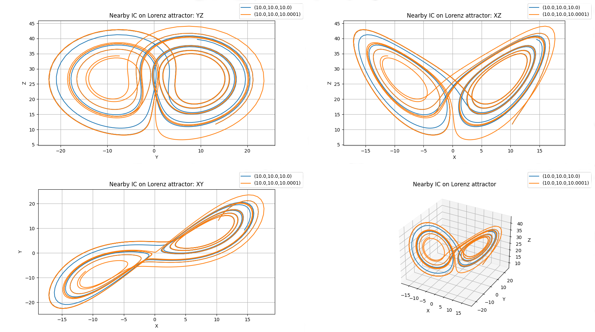

# Trajectory3D
> *class* phaseportrait.**Trajectory3D**(*dF, \*, Range=None, dF_args={}, n_points=10000, runge_kutta_step=0.01, runge_kutta_freq=1, \*\*kargs*)

Inherits from parent class [trajectory](trajectory.md).

Gives the option to represent 3D trajectories given a [dF](dFfunction.md) function with 3 args.


### **Parameters**

* **dF** : callable

    A dF type function.

### **Key Arguments** 

* **Range** : list

    Ranges of the axis in the main plot, by default None. See [Defining Range](#defining-range).
    
* **dF_args** : dict

    If necesary, must contain the kargs for the `dF` function, by default {}
    
* **n_points** : int

    Maximum number of points to be calculated and represented, by default 10000
    
* **runge_kutta_step** : float

    Step of 'time' in the Runge-Kutta method, by default 0.01
    
* **runge_kutta_freq** : int

    Number of times `dF` is aplied between positions saved, by default 1
    
* **xlabel** : str
    
    x label of the plot, by default 'X'
    
* **ylabel** : str

    y label of the plot, by default 'Y'
    
* **zlabel** : str

    z label of the plot, by default 'Z'
    


# Methods

Inherits methods from parent class [trajectory](trajectory.md), a brief resume is offered, click on the method to see more information:

* [thermalize](../trajectory/#methods) :

    Adds thermalization steps and random initial position.
        
* [initial_position](../trajectory/#methods) :

    Adds a trajectory with the given initial position.

* [initial_positions](../trajectory/#methods) :

    Adds multiple trajectories with the given initial positions.
    
* [plot](../trajectory/#methods) : 

    Prepares the plots and computes the values. 
    Returns the axis and the figure.
    
* [add_slider](../trajectory/#methods) :

    Adds a slider for the dF function.

# Defining Range

1. A single number. In this case the range is defined from zero to the given number in all axes.

2. A range, such `[lowerLimit , upperLimit]`. All axes will take the same limits.

3. Three ranges, such that `[[xAxisLowerLimit , xAxisUpperLimit], [yAxisLowerLimit , yAxisUpperLimit], [zAxisLowerLimit , zAxisUpperLimit]]`

# Examples

### Lorentz attractor: chaos

Two trajectories with similar initial positions under the influence of Lorentz equations.

```python
from phaseportrait import Trajectories3D

def Lorenz(x,y,z,*, s=10, r=28, b=8/3):
    return  -s*x+s*y, 
            -x*z+r*x-y, 
            x*y-b*z

a = Trajectory3D(
    Lorenz, 
    lines=True, 
    n_points=1300, 
    size=3, 
    mark_start_position=True, 
    Title='Nearby IC on Lorenz attractor'
    )

a.initial_position(10,10,10)
a.initial_position(10,10,10.0001)
a.plot()
```



### Halvorsen attractor

In this example we are interested in seeing the attractor, not trajectories, under the Halvorsen equations.

```python
from phaseportrait import Trajectories3D

def Halvorsen(x,y,z, *, s=1.4):
    delta = (3*s+15)
    return  -s*x+2*y-4*z-y**2+delta, 
            -s*y+2*z-4*x-z**2+delta, 
            -s*z+2*x-4*y-x**2+delta

d = Trajectory3D(
    Halvorsen, 
    dF_args={'s':1.4}, 
    n_points=10000, 
    thermalization=0, 
    numba=True, 
    size=2, 
    mark_start_point=True, 
    Title='Halvorsen attractor'
    )

d.initial_position(0,5,10)
d.plot()
```
